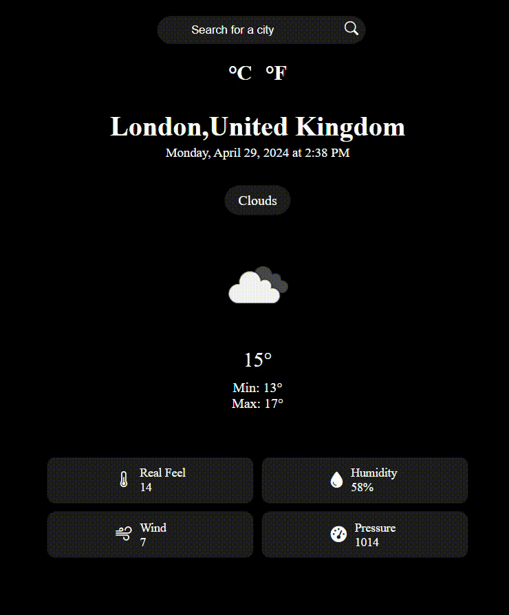

# 🌤️ Weather App

This weather application provides users with real-time weather information for a specified location. Users can view detailed weather data for any location through the application. The app offers the flexibility to display temperature measurements in either Fahrenheit or Celsius.

## 📝 Features

The application provides the following weather information for a specific location:

- **Temperature:** Displays current temperature (in Fahrenheit or Celsius).
- **Wind Speed:** Shows the current wind speed.
- **Pressure:** Provides information about atmospheric pressure.
- **Feels Like Temperature:** Indicates the perceived temperature.
- **Humidity:** Displays the current humidity level.

## 🚀 How to Use

To use the application, follow these simple steps:

1. Open the application.
2. Enter the location you want to search for.
3. Instantly view the weather data for the specified location.
4. Explore the different tabs to access specific weather information.
5. Choose your preferred temperature unit: Fahrenheit or Celsius.

The application ensures you receive up-to-date weather data for your desired location, providing you with accurate information when you need it.

Enjoy using the app! ☀️

